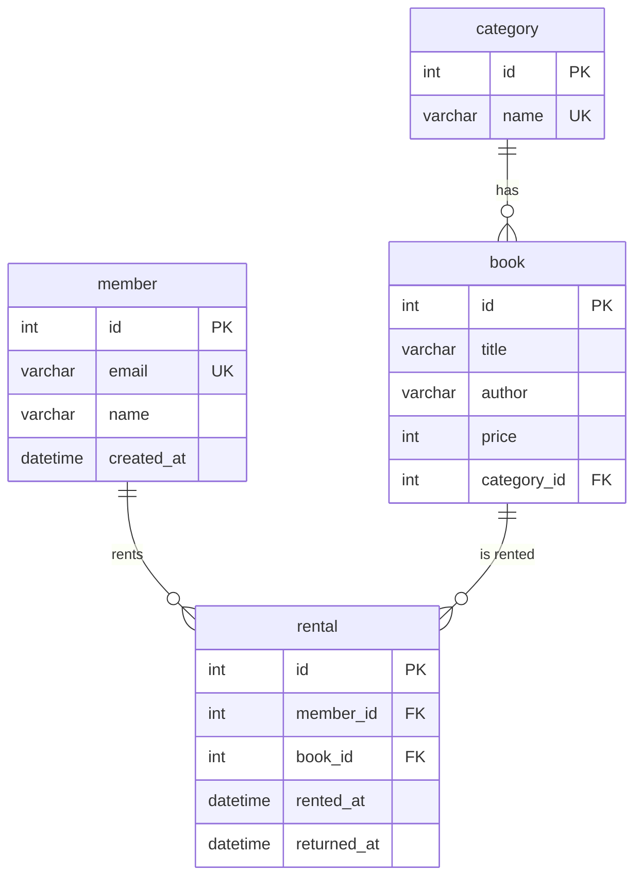

## **1. 프로젝트 개요 및 환경**
### **프로젝트 소개** 
본 프로젝트는 백엔드 프레임워크나 ORM(JPA 등)의 도움 없이, 오직 **순수 SQL**만을 이용하여 도메인 모델링부터 데이터 조작 및 비즈니스 요구사항 해결까지의 전체 백엔드 데이터 흐름을 직접 구현하는 미션입니다.

단순히 많은 데이터를 저장하는 엑셀 파일 방식을 넘어, 관계형 데이터베이스(RDB)의 핵심인 **테이블 간의 관계(Relationship)와 데이터 무결성 규칙**을 명확히 이해하고 설계하는 데 목적이 있습니다.

### **핵심 학습 목표**
1. **데이터 모델링 원리 체득**: 도메인에 맞는 테이블 구조를 설계하고 PK/FK 및 다양한 제약조건을 올바르게 설정합니다. (`데이터 모델링` ➔ `데이터 입력` ➔ `요구사항 해결`)
2. **실무 SQL 역량 강화**: 현업에서 가장 빈번하게 요구되는 검색, 정렬, 집계, 랭킹 등의 요구사항을 복잡한 애플리케이션 로직 없이 SQL 쿼리 하나로 효율적으로 해결합니다.
3. **패러다임 전환을 위한 기반 마련**: 추후 JPA/ORM 학습 시 기반이 되는 `1:N 관계`, `참조 무결성`, `조인 및 그룹화 기반 조회` 알고리즘을 SQL 관점에서 깊이 있게 체득합니다.

### **개발 환경**
- **OS (운영체제)**: macOS
- **DBMS (데이터베이스)**: MySQL 8.x (Docker Container 기반)
- **DB Client (접속 도구)**: DBeaver
- **강제 제약사항**: 순수 SQL 학습을 위해 백엔드 프레임워크(Spring, Express 등) 및 ORM(JPA)은 일절 사용하지 않음 

#### **Docker 기반 MySQL 컨테이너 실행 및 연결 방법**
1. **Docker Desktop**을 실행하여 엔진이 구동 중인지 확인합니다.
2. 터미널(PowerShell 또는 Terminal)을 열어 아래 명령어를 실행합니다.
    ```bash
    docker run -d --name mysql-container -p 3306:3306 -e MYSQL_ROOT_PASSWORD=your_password -v mysql-db-data:/var/lib/mysql mysql:8.0
    ```
    * **명령어 옵션 설명**:
      * `-d`: 백그라운드(데몬) 모드로 컨테이너를 구동하여 터미널 창을 닫아도 계속 실행되도록 합니다.
      * `--name mysql-container`: 컨테이너의 고유 이름을 `mysql-container`로 지정합니다.
      * `-p 3306:3306`: 호스트 PC의 3306 포트와 컨테이너 내부의 3306 포트를 연결(포트 포워딩)합니다.
      * `-e MYSQL_ROOT_PASSWORD=your_password`: MySQL의 `root` 최고 관리자 접속 비밀번호를 설정합니다. (`your_password` 부분을 실제 원하는 비밀번호로 변경하여 사용)
      * `-v mysql-db-data:/var/lib/mysql`: 데이터를 호스트 PC에 볼륨(Volume) 형태로 안전하게 저장하여, 컨테이너를 삭제하고 다시 띄워도 실습 데이터가 보존되도록 합니다.
      * `mysql:8.0`: Docker Hub에서 공식 MySQL 8.0 이미지 버전을 가져와 실행합니다.

## **2. 폴더 구조**

```text
B5-1/
│
├── README.md
├── schema.sql             # 테이블 정의 및 제약조건 설정 스크립트
├── insert.sql             # 10행 이상의 샘플 데이터 입력 스크립트
├── queries.sql            # 핵심 쿼리 17개 및 설명 주석
│
├── docs/ 
│   ├── answer.md
│   └── checklist.md
│
└── results/               # 쿼리 실행 결과 확인 자료 폴더
    ├── query_01_result.txt
    ├── query_02_result.txt
    └── ...
```

## **3. 데이터 모델링 및 테이블 설계 (ERD)**
### 서비스 주제: 도서 대여 관리 시스템
회원 정보, 도서 카테고리, 도서 상세 정보, 그리고 회원의 도서 대여 및 반납 이력을 유기적으로 연결하여 안전하게 관리하는 시스템입니다.

### ERD 다이어그램



### 테이블 및 관계 구조(최소 4개 테이블, 1:N 관계 2개 이상)
도메인의 역할에 따라 데이터 중복을 최소화하도록 총 4개의 테이블로 분리하여 설계했습니다

- **`member` (회원 테이블)**: 서비스를 이용하는 회원 정보를 관리합니다.
    - `id` (PK): 회원 고유 번호 
    - `email`: 로그인 및 알림용 이메일 주소
    - `name`: 회원 이름
- **`category` (카테고리 테이블)**: 도서의 분류 체계를 관리합니다.
    - `id` (PK): 카테고리 고유 번호 
    - `name`: 카테고리명 (예: 소설, IT, 역사 등)
- **`book` (도서 테이블)**: 대여 대상이 되는 도서의 상세 정보를 관리합니다.
    - `id` (PK): 도서 고유 번호 
    - `title`: 도서 제목
    - `category_id` (FK): 해당 도서가 속한 카테고리 번호 
- **`rental` (대여 기록 테이블)**: 회원이 도서를 대여하고 반납한 이력을 관리합니다.
    - `id` (PK): 대여 건별 고유 번호 
    - `member_id` (FK): 대여한 회원의 고유 번호 
    - `book_id` (FK): 대여된 도서의 고유 번호 
    - `rented_at`: 대여일 
    - `returned_at`: 반납일 (미반납 시 NULL)

**[테이블 간 1:N 관계 설정 정의]**
1.  **`category` (1) : `book` (N)** ➔ 하나의 카테고리(예: IT)에는 여러 권의 도서가 포함될 수 있습니다. (`book.category_id`가 `category.id`를 참조) 
2.  **`member` (1) : `rental` (N)** ➔ 한 명의 회원은 여러 번의 도서 대여 이력(기록)을 가질 수 있습니다. (`rental.member_id`가 `member.id`를 참조) 
3.  **`book` (1) : `rental` (N)** ➔ 한 권의 도서는 시간이 흐름에 따라 여러 번 대여될 수 있습니다. (`rental.book_id`가 `book.id`를 참조) 

### 제약조건 적용 현황
데이터의 무결성과 신뢰성을 확보하기 위해 SQL 표준 제약조건을 아래와 같이 적용했습니다

| 적용 테이블 | 컬럼명 | 제약조건 유형 | 적용 이유 및 비즈니스 규칙 |
| :--- | :--- | :--- | :--- |
| **모든 테이블** | `id` | **PRIMARY KEY** | 각 행(Row)을 유일하게 식별하고 조회 성능을 높이기 위해 기본키 지정 |
| `member` | `email` | **UNIQUE** | 한 명의 회원은 하나의 이메일만 가질 수 있으며, 중복 가입을 방지함 |
| `member` | `email`, `name` | **NOT NULL** | 회원 가입 및 관리 시 필수적으로 채워져야 하는 필수 정보로 지정 |
| `category` | `name` | **NOT NULL** | 카테고리 이름 없이 분류가 생성되는 것을 방지함 |
| `book` | `title` | **NOT NULL** | 도서 등록 시 제목이 누락되는 데이터 오류를 방지함 |
| `rental` | `member_id` | **FOREIGN KEY** | `member` 테이블의 `id`를 참조하며, 존재하지 않는 회원의 유령 대여 입력을 차단함 (참조 무결성) |
| `rental` | `book_id` | **FOREIGN KEY** | `book` 테이블의 `id`를 참조하며, 시스템에 등록되지 않은 도서의 잘못된 대여 입력을 차단함 (참조 무결성) |
| `rental` | `rented_at` | **NOT NULL** | 도서가 대여된 시점의 날짜/시간 데이터는 누락될 수 없도록 강제함 |

## **4. 핵심 SQL 쿼리 구성 요약 (총 17개)**

`queries.sql`에 작성된 핵심 비즈니스 쿼리 17개의 분류와 주요 목적을 정리한 요약 명세입니다. 각 쿼리의 구체적인 SQL 문법과 주석 설명은 `queries.sql` 파일에서 확인할 수 있습니다.

### 1. 기본 조회 쿼리 (최소 4개 이상)
조건 검색(`WHERE`), 결과 정렬(`ORDER BY`), 출력 개수 제한(`LIMIT`)을 활용한 핵심 데이터 조회 목록입니다.
- **Q1. 고가 도서 목록 조회**: 가격이 20,000원 이상인 도서 목록을 가격이 높은 순으로 정렬하여 조회합니다.
- **Q2. 특정 성씨 회원 검색**: 성이 '김'씨인 회원 목록을 `LIKE` 연산자를 사용하여 조회합니다.
- **Q3. 최신 가입 회원 조회**: 회원 가입일 역순으로 정렬하여 최근 가입한 회원 3명만 조회합니다. (MySQL 고유의 `LIMIT` 문법 사용 주석 설명 포함)
- **Q4. 대여 중인 기록 조회**: 반납일(`returned_at`)이 `NULL`인 미반납 대여 기록들을 대여일 기준 오름차순으로 조회합니다.

### 2. 조인(JOIN) 조회 쿼리 (최소 4개 이상)
테이블 간의 외래키(FK) 관계를 바탕으로 흩어진 연관 데이터를 통합하여 조회합니다.
- **Q5. 대여 중인 도서 및 회원 정보 조회 (`INNER JOIN`)**: 대여 기록과 회원, 도서 테이블을 결합하여 현재 미반납 대여 건의 도서명과 대여한 회원 이름을 조회합니다.
- **Q6. 도서별 카테고리 매칭 조회 (`INNER JOIN`)**: 도서 테이블과 카테고리 테이블을 연결하여 도서의 제목과 카테고리명을 결합해 조회합니다.
- **Q7. 전체 회원의 총 대여 횟수 조회 (`LEFT JOIN`)**: 대여 기록이 없는 회원까지 모두 포함하여 각 회원의 고유 ID, 이름 및 총 대여 횟수를 집계합니다.
- **Q8. 특정 카테고리 도서 조회 (`INNER JOIN` + `WHERE`)**: 'IT/컴퓨터' 카테고리에 속한 도서들의 제목과 저자명을 조인하여 조회합니다.

> [!NOTE]
> **INNER JOIN vs LEFT JOIN 비교 (본 프로젝트 적용 예시)**
> * **`INNER JOIN` (Q5, Q6, Q8)**: 조인하는 두 테이블 모두에 매칭되는 데이터가 존재하는 행만 결합하여 반환합니다. (예: 대여 기록이 있는 회원과 도서만 필터링되어 매칭됨)
> * **`LEFT JOIN` (Q7)**: 왼쪽 기준 테이블(member)의 모든 행을 보존하며, 오른쪽 테이블(rental)에 매칭되는 데이터가 없더라도 `NULL`(대여 횟수 0)로 결합하여 누락 없이 출력합니다.


### 3. 집계 및 그룹화 쿼리 (최소 3개 이상)
`GROUP BY`와 집계 함수를 조합하여 비즈니스 통계 데이터를 산출합니다.
- **Q9. 카테고리별 도서 수량 및 평균 가격 집계**: 각 카테고리 ID별로 속한 도서의 총 수량과 평균 가격을 그룹화하여 산출합니다.
- **Q10. 회원별 반납 완료 대여 건수 집계**: 회원 ID별로 이미 반납 처리가 완료된(`returned_at IS NOT NULL`) 대여 건수를 집계합니다.
- **Q11. 우수 회원 ID 추출 (`HAVING` 활용)**: 누적 대여 건수가 2건 이상인 회원의 ID와 대여 횟수를 그룹화하여 조건 필터링합니다.
- **Q12. 카테고리별 도서 총 가격 합계(SUM) 및 평균 가격(AVG) 조회**: 도서 테이블과 카테고리 테이블을 조인하여 각 카테고리명 별로 도서 가격의 합계와 평균을 구합니다.

### 4. 서브쿼리(Subquery) 쿼리 (최소 1개 이상)
쿼리 내부에 다른 쿼리를 중첩하여 복잡한 조건을 해결합니다.
- **Q13. 대여 이력이 없는 회원 조회 (`NOT IN` 서브쿼리)**: 대여 테이블의 회원 ID 목록에 없는 회원들의 이름을 조회합니다.
- **Q14. 평균 가격보다 비싼 도서 조회 (비교 서브쿼리)**: 서브쿼리를 이용해 전체 도서의 평균 가격을 구한 뒤, 그보다 가격이 높은 도서들의 제목과 가격을 출력합니다.

### 5. 데이터 수정 및 삭제 쿼리 (최소 2개 이상)
기존에 등록된 데이터를 안전하게 정정하거나 제거합니다.
- **Q15. 도서 반납 처리 업데이트 (`UPDATE`)**: 특정 회원(1번)이 빌린 특정 도서(2번)의 반납일(`returned_at`)을 현재 시각으로 수정합니다.
- **Q16. 유령 도서 데이터 일괄 삭제 (`DELETE`)**: 카테고리 ID가 누락되어 연결이 끊어진 도서 정보를 테이블에서 삭제합니다.

### 6. 인덱스 정의 (최소 1개 이상)
대용량 데이터 환경에서의 조회 성능 최적화를 위한 색인을 설정합니다.
- **Q17. 대여일 검색 성능 향상을 위한 인덱스 생성 (`CREATE INDEX`)**
    * **적용 구문**: `CREATE INDEX idx_rental_rented_at ON rental(rented_at);`
    * **적용 이유**: 대여일(`rented_at`) 컬럼이 대여 현황 조회나 정렬 등 `WHERE` 및 `ORDER BY` 절에 빈번하게 사용되므로, 검색 속도를 향상시키기 위해 적용했습니다.