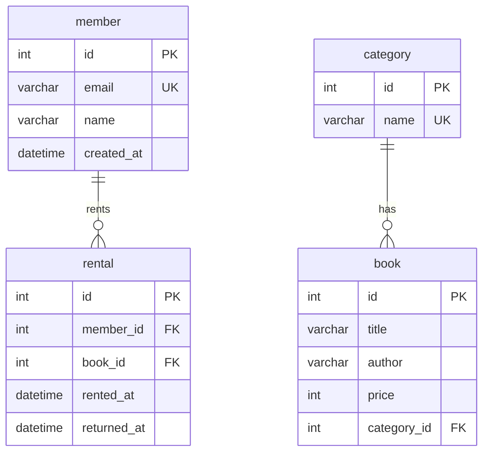

# **SQL로 만드는 나만의 데이터베이스**

## **1. 프로젝트 개요 및 환경**
### **프로젝트 소개** 
본 프로젝트는 백엔드 프레임워크나 ORM(JPA 등)의 도움 없이, 오직 **순수 SQL**만을 이용하여 도메인 모델링부터 데이터 조작 및 비즈니스 요구사항 해결까지의 전체 백엔드 데이터 흐름을 직접 구현하는 미션입니다.

단순히 많은 데이터를 저장하는 엑셀 파일 방식을 넘어, 관계형 데이터베이스(RDB)의 핵심인 **테이블 간의 관계(Relationship)와 데이터 무결성 규칙**을 명확히 이해하고 설계하는 데 목적이 있습니다.

### **핵심 학습 목표**
1. **데이터 모델링 원리 체득**: 도메인에 맞는 테이블 구조를 설계하고 PK/FK 및 다양한 제약조건을 올바르게 설정합니다. (`데이터 모델링` ➔ `데이터 입력` ➔ `요구사항 해결`)
2. **실무 SQL 역량 강화**: 현업에서 가장 빈번하게 요구되는 검색, 정렬, 집계, 랭킹 등의 요구사항을 복잡한 애플리케이션 로직 없이 SQL 쿼리 하나로 효율적으로 해결합니다.
3. **패러다임 전환을 위한 기반 마련**: 추후 JPA/ORM 학습 시 기반이 되는 `1:N 관계`, `참조 무결성`, `조인 및 그룹화 기반 조회` 알고리즘을 SQL 관점에서 깊이 있게 체득합니다.

### **개발 환경**
- **OS (운영체제)**: macOS
- **DBMS (데이터베이스)**: MySQL 8.x (Docker Container 기반)
- **DB Client (접속 도구)**: DBeaver
- **강제 제약사항**: 순수 SQL 학습을 위해 백엔드 프레임워크(Spring, Express 등) 및 ORM(JPA)은 일절 사용하지 않음 

#### **Docker 기반 MySQL 컨테이너 실행 및 연결 방법**
1. **Docker Desktop**을 실행하여 엔진이 구동 중인지 확인합니다.
2. 터미널(PowerShell 또는 Terminal)을 열어 아래 명령어를 실행합니다.
    ```bash
    docker run -d --name mysql-container -p 3306:3306 -e MYSQL_ROOT_PASSWORD=your_password -v mysql-db-data:/var/lib/mysql mysql:8.0
    ```
    * **명령어 옵션 설명**:
      * `-d`: 백그라운드(데몬) 모드로 컨테이너를 구동하여 터미널 창을 닫아도 계속 실행되도록 합니다.
      * `--name mysql-container`: 컨테이너의 고유 이름을 `mysql-container`로 지정합니다.
      * `-p 3306:3306`: 호스트 PC의 3306 포트와 컨테이너 내부의 3306 포트를 연결(포트 포워딩)합니다.
      * `-e MYSQL_ROOT_PASSWORD=your_password`: MySQL의 `root` 최고 관리자 접속 비밀번호를 설정합니다. (`your_password` 부분을 실제 원하는 비밀번호로 변경하여 사용)
      * `-v mysql-db-data:/var/lib/mysql`: 데이터를 호스트 PC에 볼륨(Volume) 형태로 안전하게 저장하여, 컨테이너를 삭제하고 다시 띄워도 실습 데이터가 보존되도록 합니다.
      * `mysql:8.0`: Docker Hub에서 공식 MySQL 8.0 이미지 버전을 가져와 실행합니다.

## **2. 폴더 구조**

```text
B5-1/
│
├── README.md
├── schema.sql             # 테이블 정의 및 제약조건 설정 스크립트
├── insert.sql             # 10행 이상의 샘플 데이터 입력 스크립트
├── queries.sql            # 핵심 쿼리 17개 및 설명 주석
│
├── docs/ 
│   ├── answer.md          # 설계 원리 및 이론 Q&A 답변 문서
│   ├── db_design.md       # 컬럼 타입 선정 사유, 제약조건, 17개 쿼리 상세 분석 설계 명세
│   ├── checklist.md       # 미션 기능 및 문서 요구사항 자가 검토용 체크리스트
│   └── query_guide.md     # SQL 쿼리 이해 및 로컬 실행 활용 가이드
│
└── results/               # 쿼리 실행 결과 확인 자료 폴더
    ├── query_01_result.txt
    ├── query_02_result.txt
    └── ...
```

## **3. 데이터 모델링 및 테이블 설계 (ERD)**
### 서비스 주제: 도서 대여 관리 시스템
회원 정보, 도서 카테고리, 도서 상세 정보, 그리고 회원의 도서 대여 및 반납 이력을 유기적으로 연결하여 안전하게 관리하는 시스템입니다.

### ERD 다이어그램



> **ERD 관계선 기호(Cardinality) 설명**
> * **`||` (One and Only One)**: 반드시 1개 존재해야 함을 뜻합니다. (부모 테이블 측)
> * **`o{` (Zero or More)**: 0개 또는 그 이상(N개) 존재할 수 있음을 뜻합니다. (자식 테이블 측)
> * **`||--o{` (1:N 관계)**: 예를 들어 `member ||--o{ rental`은 회원은 반드시 1명(`||`) 존재해야 하며, 해당 회원의 대여 기록은 0건이거나 여러 건(`o{`) 존재할 수 있음을 의미합니다.


### 테이블 및 관계 구조(최소 4개 테이블, 1:N 관계 2개 이상)
도메인의 역할에 따라 데이터 중복을 최소화하도록 총 4개의 테이블로 분리하여 설계했습니다

- **`member` (회원 테이블)**: 서비스를 이용하는 회원 정보를 관리합니다.
    - `id` (PK): 회원 고유 번호 
    - `email`: 로그인 및 알림용 이메일 주소
    - `name`: 회원 이름
    - `created_at`: 회원 가입 일시 (기본값: 현재 시각)

- **`category` (카테고리 테이블)**: 도서의 분류 체계를 관리합니다.
    - `id` (PK): 카테고리 고유 번호 
    - `name`: 카테고리명 (예: 소설, IT, 역사 등)
- **`book` (도서 테이블)**: 대여 대상이 되는 도서의 상세 정보를 관리합니다.
    - `id` (PK): 도서 고유 번호 
    - `title`: 도서 제목
    - `author`: 도서 저자
    - `price`: 도서 가격 (원화 단위)
    - `category_id` (FK): 해당 도서가 속한 카테고리 번호 

- **`rental` (대여 기록 테이블)**: 회원이 도서를 대여하고 반납한 이력을 관리합니다.
    - `id` (PK): 대여 건별 고유 번호 
    - `member_id` (FK): 대여한 회원의 고유 번호 
    - `book_id` (FK): 대여된 도서의 고유 번호 
    - `rented_at`: 대여일 
    - `returned_at`: 반납일 (미반납 시 NULL)

**[테이블 간 1:N 관계 설정 정의]**
1.  **`category` (1) : `book` (N)** ➔ 하나의 카테고리(예: IT)에는 여러 권의 도서가 포함될 수 있습니다. (`book.category_id`가 `category.id`를 참조) 
2.  **`member` (1) : `rental` (N)** ➔ 한 명의 회원은 여러 번의 도서 대여 이력(기록)을 가질 수 있습니다. (`rental.member_id`가 `member.id`를 참조) 
3.  **`book` (1) : `rental` (N)** ➔ 한 권의 도서는 시간이 흐름에 따라 여러 번 대여될 수 있습니다. (`rental.book_id`가 `book.id`를 참조) 

## **4. 데이터베이스 세부 명세 및 제약조건**

각 컬럼의 데이터 타입 선정 배경(INT, VARCHAR, DATETIME 등)과 데이터 무결성을 보장하기 위한 제약조건 설정 근거는 별도의 상세 설계 문서에 작성되어 있습니다.

- **상세 문서**: [컬럼 타입 선정 기준 및 제약조건 설계 명세서 (docs/db_design.md)](docs/db_design.md)

---

## **5. 핵심 SQL 쿼리 구성 요약 (총 17개)**

비즈니스 요구사항 해결을 위한 17개의 핵심 SQL 쿼리가 작성되어 있습니다. 각 쿼리의 작동 원리 및 상세한 기능 명세는 상세 설계 문서에서 볼 수 있으며, 실행 코드는 `queries.sql` 파일에서 제공됩니다.

- **상세 분석**: [17개 핵심 쿼리 상세 분석 명세 (docs/db_design.md#3-핵심-sql-쿼리-상세-분석-총-17개)](docs/db_design.md#3-핵심-sql-쿼리-상세-분석-총-17개)
- **소스코드**: [실행 쿼리 소스코드 (queries.sql)](queries.sql)


### **쿼리 카테고리 분류 요약**
1. **기본 조회 (4개)**: 고가 도서 조회, 특정 성씨 검색, 최신 가입 회원 조회(LIMIT), 미반납 대여 조회
2. **조인 조회 (4개)**: 미반납 대여 상세 정보, 도서별 카테고리 매칭, 회원별 누적 대여 횟수(LEFT JOIN), 특정 카테고리 도서 조회
3. **집계 및 그룹화 (4개)**: 카테고리별 도서 수 및 평균가, 회원별 반납 완료 건수, 우수 회원 ID 추출(HAVING), 카테고리별 총합/평균가(SUM, AVG)
4. **서브쿼리 (2개)**: 미대여자 목록 추출(NOT IN), 평균가 초과 도서 목록 추출
5. **데이터 변경 (2개)**: 도서 반납 일자 갱신(UPDATE), 카테고리 없는 도서 일괄 삭제(DELETE)
6. **성능 최적화 (1개)**: 대여일 검색 성능 향상을 위한 인덱스 정의(CREATE INDEX)

---

## **6. SQL 쿼리 실행 및 활용 가이드**

로컬 환경에서 데이터베이스를 연동하고, `schema.sql`을 통한 스키마 구축, `insert.sql`을 통한 데이터 삽입, 그리고 `queries.sql` 내 17개 쿼리의 상세 설명 및 실무 활용 팁을 제공하는 가이드 문서가 준비되어 있습니다.

- **쿼리 활용 가이드**: [SQL 쿼리 활용 가이드 (docs/query_guide.md)](docs/query_guide.md)