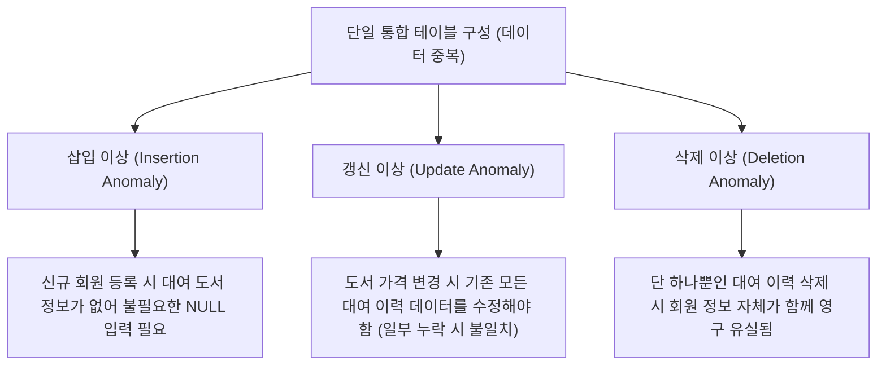
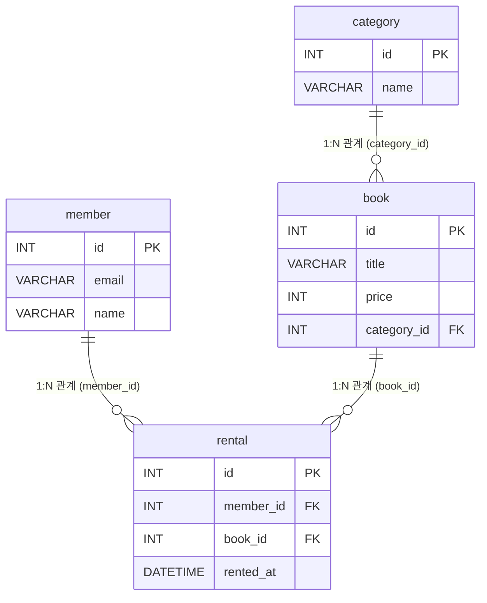
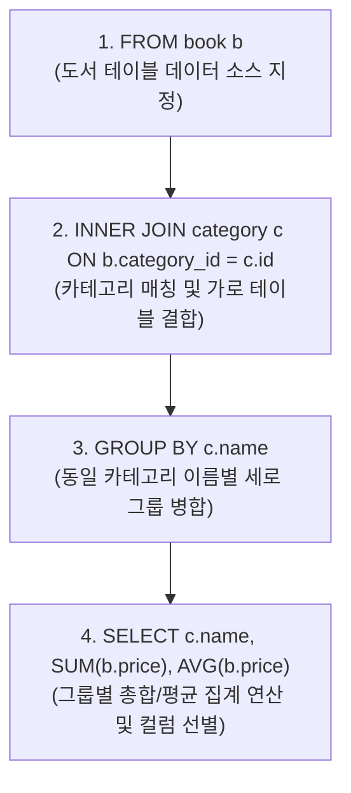

# 도서 대여 관리 시스템 - 핵심 질문 답변서 (Answer Sheet)

본 문서는 데이터베이스 이론의 핵심 개념들과 본 프로젝트의 스키마 설계 및 SQL 작성 경험을 연결하여 상세히 답변한 설명서입니다.

---

### Q1. 데이터베이스는 엑셀과 무엇이 다르며, 왜 테이블을 나누어 저장하나요?

#### 1.1. 데이터베이스(DBMS)와 엑셀(Excel)의 핵심 차이점
* **동시성 제어 (Concurrency Control)**: 엑셀은 다중 사용자가 동시에 동일한 시트나 셀을 수정하려고 할 때 데이터 유실이나 파일 잠금(Lock) 충돌이 일어나기 쉽습니다. 반면 데이터베이스는 트랜잭션(Transaction) 관리와 세분화된 락(Lock) 메커니즘을 통해 수백~수천 명의 사용자가 동시에 안전하게 데이터를 읽고 쓸 수 있도록 보장합니다.
* **데이터 무결성 (Data Integrity)**: 엑셀은 어떠한 셀에도 제한 없이 임의의 잘못된 데이터 타입을 입력할 수 있어 오염에 취약합니다. 데이터베이스는 테이블 정의 단계에서 PK, FK, UNIQUE, NOT NULL, CHECK 등의 제약조건을 강제하여 데이터 규칙에 위배되는 비정상 입력/수정 시도를 데이터베이스 엔진 차원에서 차단합니다.
* **대용량 데이터 처리 및 검색 성능**: 엑셀은 단일 시트당 약 100만 행 내외의 저장 한계가 있고, 데이터가 수만 건만 되어도 파일이 무거워지고 실행 속도가 급격히 저하됩니다. 데이터베이스는 인덱싱(Indexing), 쿼리 옵티마이저(Query Optimizer) 등을 활용하여 수억 건이 넘는 대규모 데이터도 밀리초(ms) 단위로 신속하게 검색 및 정렬해 줍니다.

#### 1.2. 테이블을 나누어 저장해야 하는 이유 (이상 현상 - Anomalies)
모든 데이터(회원 정보, 카테고리 정보, 도서명, 대여 일시 등)를 하나의 커다란 엑셀 시트나 단일 테이블에 모아서 저장하게 되면, 동일한 회원 정보와 도서 정보가 대여될 때마다 매번 중복 입력되어야 합니다. 이러한 데이터 중복은 데이터베이스에서 다음과 같은 세 가지 **이상 현상(Anomalies)**을 유발합니다.



1. **삽입 이상 (Insertion Anomaly)**: 신규 회원을 등록하려 하지만 아직 책을 빌린 이력이 없을 때, 대여 도서 ID나 대여 일시 컬럼이 존재하므로 불필요하게 `NULL`을 무수히 채워 넣어야 하거나 강제로 대여 데이터를 가공해 넣지 않으면 회원 등록이 불가능해지는 현상입니다.
2. **갱신 이상 (Update Anomaly)**: 특정 도서의 가격이 20,000원에서 22,000원으로 인상되었을 때, 단일 테이블 체제에서는 해당 도서를 대여한 이력이 있는 수백 건의 레코드를 일일이 찾아서 가격을 수정해야 합니다. 이때 일부 레코드가 누락되면 동일한 책의 가격 정보가 다르게 표시되는 불일치 오류가 생깁니다.
3. **삭제 이상 (Deletion Anomaly)**: 어떤 회원이 대여한 단 한 건의 대여 이력을 반납/취소 처리하기 위해 해당 행을 삭제했는데, 그 행에 같이 적혀 있던 회원의 이메일, 가입일 등 회원 정보 전체가 데이터베이스에서 영구적으로 소멸해 버리는 현상입니다.

> [!NOTE]
> 본 도서 대여 관리 시스템에서는 이러한 이상 현상들을 해결하기 위해 데이터 간의 중복성을 제거하고 정합성을 극대화하도록 역할을 분할한 4개의 테이블(**`member`**, **`category`**, **`book`**, **`rental`**)로 정규화하여 설계했습니다.

---

### Q2. PK(기본키)와 FK(외래키)의 역할은 무엇이며, 1:N 관계는 데이터를 어떻게 연결하나요?

#### 2.1. PK와 FK의 정의 및 역할
* **PK (Primary Key, 기본키)**: 테이블의 각 행(Row)을 유일하고 고유하게 식별할 수 있도록 해주는 기준 식별자입니다. 기본키는 테이블에 반드시 존재해야 하며, 중복값을 가질 수 없고 결코 비어 있을 수 없습니다(`NOT NULL`).
* **FK (Foreign Key, 외래키)**: 어떤 테이블의 특정 컬럼이 다른 테이블의 기본키(PK)를 참조하여 관계를 형성하는 키입니다. 외래키는 두 테이블 간의 논리적 연결 고리를 담당하며, 부모 테이블에 존재하지 않는 데이터가 자식 테이블에 마음대로 입력되는 것을 차단하는 **참조 무결성(Referential Integrity)**을 보장해 줍니다.

#### 2.2. 본 프로젝트 스키마의 1:N 관계 매핑 및 데이터 연결 방식
1:N 관계란 '1'에 해당하는 부모 테이블의 PK 컬럼 값을, 'N'에 해당하는 자식 테이블이 외래키(FK) 컬럼으로 참조하여 데이터를 연결하는 방식입니다.



* **`category` $\rightarrow$ `book` (1:N)**: 한 카테고리에 여러 도서가 소속됩니다. 부모 테이블 `category(id)`의 값을 자식 테이블 `book(category_id)`에서 외래키로 참조합니다.
* **`member` $\rightarrow$ `rental` (1:N)**: 한 회원이 여러 번 도서를 대여할 수 있습니다. 부모 테이블 `member(id)`를 자식 테이블 `rental(member_id)`에서 외래키로 참조합니다.
* **`book` $\rightarrow$ `rental` (1:N)**: 한 권의 책이 여러 회원에게 차례대로 대여될 수 있습니다. 부모 테이블 `book(id)`를 자식 테이블 `rental(book_id)`에서 외래키로 참조합니다.

#### 2.3. 구체적인 관계 조회 및 데이터 연결 예시 (Q6 - 도서별 카테고리 매칭)
* **조회 SQL 쿼리 ([queries.sql](../queries.sql) Q6)**:
  ```sql
  SELECT b.id, b.title, c.name AS 카테고리명
  FROM book b
  INNER JOIN category c ON b.category_id = c.id;
  ```
* **실제 데이터 연결 실행 결과 ([query_06_result.txt](../results/query_06_result.txt))**:
  ```
  +----+---------------------+------------+
  | id | title               | 카테고리명 |
  +----+---------------------+------------+
  |  1 | 이것이 MySQL이다    | IT/컴퓨터  |
  |  2 | 맛있는 파이썬       | IT/컴퓨터  |
  |  3 | 소설 한강 1         | 소설       |
  |  4 | 사피엔스            | 인문학     |
  |  5 | 트렌드 코리아 2026  | 경제/경영  |
  |  6 | 원씽(The One Thing) | 자기계발   |
  |  7 | 서시와 별 헤는 밤   | 시/에세이  |
  |  8 | 역사의 쓸모         | 역사       |
  |  9 | 코스모스            | 과학       |
  | 10 | 방구석 미술관       | 예술       |
  +----+---------------------+------------+
  ```
  *설명*: 도서 테이블(`book`)의 `category_id` (FK)에 기입된 숫자가 카테고리 테이블(`category`)의 `id` (PK)와 정상 결합함으로써, 1번 도서인 '이것이 MySQL이다'의 카테고리가 'IT/컴퓨터'라는 것을 한눈에 확인할 수 있습니다.

---

### Q3. SQL의 핵심 구문들(SELECT/INSERT/UPDATE/DELETE)은 각각 언제 쓰이나요?

* **SELECT**: 데이터베이스에 저장되어 있는 데이터를 조회하거나, 정렬, 조건 필터링, 합산/평균 등의 통계적 집계를 수행하여 원하는 정보를 추출하고자 할 때 사용합니다.
  - *예시*: `SELECT * FROM book WHERE price >= 20000;` (2만 원 이상 도서 조회)
* **INSERT**: 테이블에 새로운 레코드(행)를 삽입하여 새로운 개체를 추가하고자 할 때 사용합니다.
  - *예시*: `INSERT INTO member (email, name) VALUES ('new@example.com', '홍길동');` (신규 회원 등록)
* **UPDATE**: 이미 데이터베이스에 등록되어 존재하는 특정 로우의 컬럼 데이터 값을 수정하고자 할 때 사용합니다. 반드시 `WHERE` 절을 통해 수정 대상을 엄격하게 제한해야 오작동을 막을 수 있습니다.
  - *예시*: `UPDATE rental SET returned_at = CURRENT_TIMESTAMP WHERE id = 5;` (반납 처리 기록 수정)
* **DELETE**: 더 이상 사용할 필요가 없는 행 데이터를 테이블에서 영구적으로 지울 때 사용합니다. `UPDATE`와 마찬가지로 `WHERE` 조건을 빠뜨리면 테이블 내 모든 데이터가 소멸되므로 각별히 주의해야 합니다.
  - *예시*: `DELETE FROM book WHERE category_id IS NULL;` (분류가 끊긴 도서 일괄 삭제)

---

### Q4. JOIN과 GROUP BY로 "연결된 데이터를 한 번에 뽑는 방법"은 무엇인가요?

#### 4.1. INNER JOIN vs LEFT JOIN 작동 원리 및 문법 차이
* **`INNER JOIN` (내부 조인)**: 조인 조건(`ON` 절)으로 지정된 연결 고리 컬럼의 값이 **양쪽 테이블 모두에 공통으로 존재하는 매칭 데이터**만 결과에 포함시킵니다. 한쪽 테이블에 조인 대상이 없으면 결과 데이터 셋에서 완전히 배제됩니다.
* **`LEFT JOIN` (외부 조인)**: FROM 절의 기준 테이블(왼쪽)에 있는 **모든 행을 먼저 보존**한 상태에서 조인 대상 테이블(오른쪽)의 컬럼을 붙입니다. 매칭되는 데이터가 오른쪽 테이블에 존재하지 않더라도, 왼쪽 테이블의 행은 살아남고 오른쪽 테이블에서 온 데이터 영역들은 전부 `NULL`값으로 표시됩니다.

#### 4.2. 실행 결과 대조를 통한 동작 방식 비교

##### 1) INNER JOIN 예시 (현재 미반납 대여 중인 회원의 이름과 도서 정보 매칭 - Q5)
* **실행 쿼리**:
  ```sql
  SELECT m.name AS 회원명, b.title AS 도서명, r.rented_at AS 대여일
  FROM rental r
  INNER JOIN member m ON r.member_id = m.id
  INNER JOIN book b ON r.book_id = b.id
  WHERE r.returned_at IS NULL;
  ```
* **실행 결과 ([query_05_result.txt](../results/query_05_result.txt))**:
  ```
  +--------+---------------------+---------------------+
  | 회원명 | 도서명              | 대여일              |
  +--------+---------------------+---------------------+
  | 김철수 | 맛있는 파이썬       | 2026-06-10 11:30:00 |
  | 이영희 | 사피엔스            | 2026-06-16 09:00:00 |
  | 최지우 | 소설 한강 1         | 2026-06-15 13:00:00 |
  | 정대만 | 원씽(The One Thing) | 2026-06-15 17:00:00 |
  | 정대만 | 코스모스            | 2026-06-17 10:00:00 |
  | 강백호 | 역사의 쓸모         | 2026-06-18 11:00:00 |
  | 서태웅 | 방구석 미술관       | 2026-06-18 15:45:00 |
  +--------+---------------------+---------------------+
  ```
  - *분석*: `rental` 테이블의 `returned_at`이 NULL인 대여 레코드 7건에 대해, 회원 정보(`member`) 및 도서 정보(`book`)가 완벽하게 일치하는 교집합 행만 표시됩니다. 대여 기록이 아예 없는 회원은 출력 조건에 맞지 않아 표시되지 않습니다.

##### 2) LEFT JOIN 예시 (전체 회원 리스트 및 각 회원당 총 대여 건수 집계 - Q7)
* **실행 쿼리**:
  ```sql
  SELECT m.id, m.name, COUNT(r.id) AS 총_대여_횟수
  FROM member m
  LEFT JOIN rental r ON m.id = r.member_id
  GROUP BY m.id, m.name;
  ```
* **실행 결과 ([query_07_result.txt](../results/query_07_result.txt))**:
  ```
  +----+--------+--------------+
  | id | name   | 총_대여_횟수 |
  +----+--------+--------------+
  | 1  | 김철수 | 2            |
  | 2  | 이영희 | 2            |
  | 3  | 박민수 | 1            |
  | 4  | 최지우 | 1            |
  | 5  | 정대만 | 2            |
  | 6  | 강백호 | 1            |
  | 7  | 서태웅 | 1            |
  | 8  | 송태섭 | 0            |
  | 9  | 신준섭 | 0            |
  | 10 | 홍길동 | 0            |
  +----+--------+--------------+
  ```
  - *분석*: 대여 기록 유무에 관계없이 `member(m)` 테이블의 모든 회원 10명이 결과에 포함됩니다. 대여 건수가 단 한 건도 존재하지 않는 `송태섭`, `신준섭`, `홍길동` 회원은 오른쪽 테이블인 `rental(r)`이 매칭되지 않아 `NULL` 상태였으나, `COUNT(r.id)` 함수 집계 시 `0`으로 처리되어 총 대여 건수가 0회인 우수하지 않은 일반 회원으로 정확하게 반영되었습니다. 만약 여기서 `INNER JOIN`을 사용했다면 이 3명은 조회 결과에 포함되지 못했을 것입니다.

---

### Q5. 실무에서 흔한 요구(검색/정렬/집계/랭킹)를 SQL로 어떻게 해결하나요?

#### 5.1. GROUP BY와 집계 함수의 동작 원리
`GROUP BY` 절은 지정된 컬럼의 값이 동일한 레코드들을 모아 하나의 단위(그룹)로 병합(Consolidation)하는 역할을 합니다. 이렇게 그룹화된 상태에서 집계 함수(`COUNT`, `SUM`, `AVG`, `MAX`, `MIN`)를 적용하면, 각각의 그룹마다 하나의 결과값을 도출하여 최종적으로 그룹당 단 1개의 로우(Row)로 변환시킵니다.

#### 5.2. WHERE와 HAVING의 차이 및 실행 순서
* **`WHERE`**: 데이터베이스에서 원본 테이블로부터 데이터를 꺼내 올 때 **행(Row)별로 조건에 부합하는지 먼저 걸러냅니다.** 그룹화가 이뤄지기 전에 실행되므로, 조건식에 집계 함수를 포함하여 비교할 수 없습니다.
* **`HAVING`**: `GROUP BY`가 완료되어 데이터 그룹들이 형성된 상태에서, **완성된 그룹을 대상으로 필터링 조건을 설정**합니다. 이미 연산이 끝난 집계 함수의 결괏값을 비교식에 사용할 수 있습니다.

#### 5.3. 실무 집계 쿼리 예시 및 동작 과정 설명 (누적 대여 건수가 2건 이상인 우수 회원 추출 - Q11)
* **실행 쿼리**:
  ```sql
  SELECT member_id, COUNT(id) AS 대여_건수
  FROM rental
  GROUP BY member_id
  HAVING COUNT(id) >= 2;
  ```
* **실행 결과 ([query_11_result.txt](../results/query_11_result.txt))**:
  ```
  +-----------+-----------+
  | member_id | 대여_건수 |
  +-----------+-----------+
  | 1         | 2         |
  | 2         | 2         |
  | 5         | 2         |
  +-----------+-----------+
  ```
* **쿼리의 처리 단계**:
  1. `FROM rental`: 대여 이력 테이블의 전체 데이터를 메모리에 로드합니다.
  2. `GROUP BY member_id`: 대여 기록들의 `member_id` 값을 비교하여, 1번 회원 그룹, 2번 회원 그룹, 3번 회원 그룹 등으로 데이터를 한 바구니에 담듯이 묶습니다.
  3. `HAVING COUNT(id) >= 2`: 회원 ID별 대여 수량(`COUNT(id)`)을 세어본 뒤, 그 건수가 2 이상인 회원 그룹(1, 2, 5번)만 남기고, 2건 미만인 회원 그룹(3, 4, 6, 7번 등)은 전부 탈락시킵니다.
  4. `SELECT member_id, COUNT(id)`: 살아남은 그룹의 식별자 값과 집계된 대여 건수만 최종 선별하여 출력합니다.

---

### Q6. 인덱스(INDEX)가 왜 필요하며, 어떤 컬럼에 적용하면 좋은가요?

#### 6.1. 인덱스의 개념과 필요성
인덱스(INDEX)는 도서 뒤편에 있는 '색인/찾아보기'와 같습니다.
* **인덱스가 없을 때**: 데이터가 많을 때 검색 조건에 맞는 데이터를 찾기 위해 테이블의 첫 번째 줄부터 마지막 줄까지 전부 조사해야 하는 **풀 테이블 스캔(Full Table Scan)**이 발생합니다. 이는 데이터 양($N$)이 늘어날수록 검색 성능이 $O(N)$으로 정비례하게 나빠져 심각한 시스템 지연을 유발합니다.
* **인덱스가 존재할 때**: 지정한 컬럼의 값들을 정렬하여 트리 구조(주로 **B-Tree 구조**)로 별도 보관합니다. 검색 또는 정렬 수행 시 루트 노드부터 탐색 기준에 맞는 노드 경로만 타고 내려가는 **인덱스 레인지 스캔(Index Range Scan)**을 처리합니다. 이에 따라 탐색 성능이 **$O(\log N)$**으로 압축되어 테이블 전체를 뒤질 필요 없이 원하는 데이터를 순식간에 찾아냅니다.

##### [참고] $O(N)$ vs $O(\log N)$의 실제 성능 차이
데이터 건수($N$)의 규모가 증가함에 따라 검색에 필요한 최대 탐색(비교) 횟수의 격차는 천문학적으로 벌어집니다. (이진 트리 기준 예시)

| 데이터 규모 ($N$) | 풀 테이블 스캔 $O(N)$ | 인덱스 스캔 $O(\log_2 N)$ | 성능 차이 (연산 속도 환산) |
| :--- | :---: | :---: | :---: |
| **10건** | 10회 | 약 3회 | 약 3.3배 빠름 |
| **1,000건** | 1,000회 | 약 10회 | **100배** 빠름 |
| **1,000,000건** (100만 건) | 1,000,000회 | 약 20회 | **50,000배** 빠름 |
| **1,000,000,000건** (10억 건) | 1,000,000,000회 | 약 30회 | **약 3,333만 배** 빠름 |

* **$O(N)$ (선형 시간 복잡도)**: 데이터를 처음부터 끝까지 하나씩 모두 비교하므로, 데이터가 1,000배 커지면 검색 시간도 1,000배 정비례하여 증가해 성능이 선형적으로 하락합니다.
* **$O(\log N)$ (로그 시간 복잡도)**: 탐색 범위를 지속적으로 반씩 쪼개며 접근하므로, 데이터 규모가 100만 배, 10억 배로 폭발하더라도 필요한 비교 횟수는 20~30회 내외에 수렴해 높은 성능을 상시 일정하게 유지합니다.


```
[인덱스 미적용: Full Table Scan - O(N)]
[행 1] -> [행 2] -> [행 3] -> ... -> [행 1,000,000] (전체 탐색)

[인덱스 적용: B-Tree Index Scan - O(log N)]
           [루트 노드]
           /        \
     [브랜치]       [브랜치]
     /      \       /      \
  [리프]  [리프]  [리프]  [리프] (해당 값 범위만 즉시 접근)
```

##### B-Tree vs B+Tree 핵심 비교
MySQL의 InnoDB 엔진 등 대부분의 관계형 데이터베이스는 인덱스 구조로 B-Tree를 확장 및 개선한 **B+Tree**를 사용합니다. 두 구조의 대표적인 차이점은 다음과 같습니다.

| 비교 항목 | B-Tree | B+Tree |
| :--- | :--- | :--- |
| **데이터 저장 위치** | 모든 노드(루트, 브랜치, 리프)에 키와 데이터를 함께 저장 | **오직 리프 노드(Leaf Node)**에만 키와 실제 데이터를 함께 저장 (루트 및 브랜치는 탐색 경로용 키만 저장) |
| **노드당 키 수용량** | 노드가 데이터 레코드를 직접 가져 노드당 담을 수 있는 인덱스 키의 수가 적음 | 중간 노드가 데이터 값을 갖지 않으므로 더 많은 키를 저장할 수 있어 **트리의 높이(Depth)가 낮아짐** |
| **범위 검색 (Range Query)** | 인덱스 순서대로 범위 검색 시 모든 노드를 위아래로 재귀 탐색해야 해서 비효율적 | 모든 리프 노드가 **더블 링크드 리스트(가로 방향)로 연결**되어 있어 범위 검색 시 선형 스캔이 매우 효율적 |
| **조회 성능** | 중간 노드에서 바로 탐색 완료 시 빠르게 끝날 수 있으나 데이터 위치별 편차가 존재 | 무조건 리프 노드까지 도달해야 하므로 **항상 동일한 시간 복잡도($O(\log N)$)**를 보장 |

#### 6.2. 인덱스 생성 추천 컬럼
* `WHERE` 조건절에서 필터링 기준으로 높은 빈도로 지정되는 컬럼
* 테이블 간 `JOIN`을 맺을 때 연결 조건(`ON` 절)의 대상 컬럼 (보통 PK 및 FK 컬럼)
* `ORDER BY` 절을 통해 정렬의 기준이 자주 되는 컬럼

#### 6.3. 본 프로젝트의 인덱스 적용 및 성능 향상 효과 (Q17)
* **인덱스 생성 DDL**:
  ```sql
  CREATE INDEX idx_rental_rented_at ON rental(rented_at);
  ```
* **성능 최적화 분석**:
  대여 테이블(`rental`)에 쌓여있는 수십만 건의 대여 이력 중 특정 기간(예: 최근 7일 이내 대여 기록)의 데이터를 필터링하거나 대여일 역순(`ORDER BY rented_at DESC`) 정렬을 수행할 때, `rented_at` 컬럼에 적용된 인덱스가 있으면 정렬 연산 비용을 원천 차단하고 조건에 해당하는 특정 대여 시각 레코드만 B-Tree 경로를 통해 빠르게 검색해 내기 때문에 대규모 환경에서도 고성능을 일정하게 유지하게 됩니다.

---

### Q7. 작성한 쿼리 중 가장 복잡한 쿼리를 선택하고, 이를 단계별로 풀어서 설명해 주세요.

#### 7.1. 대상 복잡 쿼리 (카테고리별 도서 총 가격합 및 평균 가격 집계 - Q12)
* **작성 쿼리**:
  ```sql
  SELECT c.name AS 카테고리명, SUM(b.price) AS 총_가격, AVG(b.price) AS 평균_가격
  FROM book b
  INNER JOIN category c ON b.category_id = c.id
  GROUP BY c.name;
  ```

#### 7.2. 쿼리의 단계별 처리 및 실행 순서 (Logical Query Execution Order)
데이터베이스 내부 옵티마이저는 SQL문이 작성된 문법 순서와 달리 아래의 물리적 순서대로 쿼리를 실행하여 결과 데이터를 완성합니다.



1. **`FROM book b`**:
   - 쿼리의 연산 대상이 될 주 테이블로 도서(`book`) 테이블을 선정하고 데이터 소스를 불러옵니다.
2. **`INNER JOIN category c ON b.category_id = c.id`**:
   - `book` 테이블의 외래키 `category_id`와 `category` 테이블의 `id` 컬럼을 일대일 비교하여, 같은 값을 가지는 레코드를 서로 붙여 하나의 거대한 가상의 결합 테이블 형태로 가로로 확장합니다. (카테고리에 속하지 않는 도서나 도서가 존재하지 않는 카테고리는 탈락시킵니다.)
3. **`GROUP BY c.name`**:
   - 조인 처리되어 생성된 가상 테이블 데이터 중 카테고리 이름(`c.name`)의 텍스트가 일치하는 행끼리 세로로 묶습니다. 예컨대 'IT/컴퓨터'에 해당하는 행들이 하나의 그룹이 되고, '소설'이 다른 그룹이 됩니다.
4. **`SELECT c.name, SUM(b.price), AVG(b.price)`**:
   - 각 카테고리 그룹에 할당된 개별 도서의 가격(`b.price`)을 모두 더하는 `SUM(b.price)` 집계를 처리하고, 도서 개수로 나눈 `AVG(b.price)`를 연산합니다. 마지막으로 표시하고 싶은 결과 항목을 가공하여 각 카테고리당 1행씩 매핑된 형태로 화면에 돌려줍니다.

* **실행 결과 ([query_12_result.txt](../results/query_12_result.txt))**:
  ```
  +------------+---------+-----------+
  | 카테고리명 | 총_가격 | 평균_가격 |
  +------------+---------+-----------+
  | IT/컴퓨터  | 55000   | 27500.0   |
  | 경제/경영  | 19000   | 19000.0   |
  | 과학       | 20000   | 20000.0   |
  | 소설       | 15000   | 15000.0   |
  | 시/에세이  | 12000   | 12000.0   |
  | 역사       | 16000   | 16000.0   |
  | 예술       | 18000   | 18000.0   |
  | 인문학     | 22000   | 22000.0   |
  | 자기계발   | 17000   | 17000.0   |
  +------------+---------+-----------+
  ```

---

### Q8. 미션 수행 중 가장 어려웠던 부분과 이를 어떻게 해결하셨나요?

#### 8.1. 직면했던 문제 상황: 외래키 제약조건에 따른 DDL/DML 실행 순서 엉킴 현상
데이터베이스 스키마 설계 시, 참조 무결성을 높이기 위해 `rental` $\rightarrow$ `member` / `book`, 그리고 `book` $\rightarrow$ `category` 방향으로 3개의 외래키(FK) 관계를 구축했습니다. 이 상태에서 테이블 재생성 DDL 테스트를 수행할 때 다음과 같은 오류들이 연쇄적으로 발생했습니다.
* **테이블 삭제 오류**: 부모 테이블인 `member`나 `category`를 자식 테이블보다 먼저 삭제(`DROP TABLE`)하려 하면, 외래키 참조 관계가 끊어진다는 오류메시지와 함께 처리가 완전히 실패했습니다.
* **데이터 일괄 초기화 실패**: 테이블을 비우고 테스트 데이터를 다시 밀어 넣는 작업 시, `TRUNCATE TABLE`을 실행하면 역시 자식 테이블의 참조 무결성 락에 막혀 테이블 초기화가 이뤄지지 못했습니다.

#### 8.2. 이를 극복한 구체적인 해결 방안 및 설계 기준
이 문제를 올바르게 제어하고 정상적인 동작 상태를 확보하기 위해 세 가지 명확한 해결책을 도입했습니다.

1. **엄격한 DDL 실행 순서 준수 설계**:
   - `schema.sql` 상단에 테이블 삭제 순서를 자식 테이블에서 부모 테이블 순서로 명확히 배열했습니다.
     - `rental` (자식) $\rightarrow$ `book` (중간 자식) $\rightarrow$ `member` (부모) $\rightarrow$ `category` (부모) 순으로 순차 제거한 후 역순으로 생성하여 에러를 피했습니다.
2. **외래키 제약조건의 동적 활성/비활성 제어 (`SET FOREIGN_KEY_CHECKS`)**:
   - `insert.sql`에서 테이블 초기화 시 무결성 제한을 잠시 우회하기 위해 `SET FOREIGN_KEY_CHECKS = 0;` 구문을 활용해 제약조건 검사를 비활성화하고, 삭제 및 데이터 삽입이 완료된 즉시 `SET FOREIGN_KEY_CHECKS = 1;`로 환원하여 실제 대여 입력 상황에서는 비즈니스 정합성이 상시 발휘되도록 통제했습니다.
3. **참조 상태 변화에 대한 연쇄 옵션의 구체적 분리 적용**:
   - 카테고리(`category`) 삭제 시 해당 카테고리에 할당된 도서 정보(`book`)는 카테고리만 소실되고 도서 자체는 남도록 `ON DELETE SET NULL`을 처리하여 비즈니스 논리에 맞췄습니다.
   - 반면, 회원(`member`)이나 도서(`book`) 정보가 완전 탈퇴/소멸될 때에는 남아있어 봤자 의미 없는 과거 대여 정보(`rental`)가 정합성에 위해를 주는 유령 데이터가 되지 않도록 `ON DELETE CASCADE`를 적용해 연쇄 삭제되도록 구축했습니다. 이 방식을 통해 데이터 삭제 시나리오까지 완벽히 컨트롤하게 되었습니다.